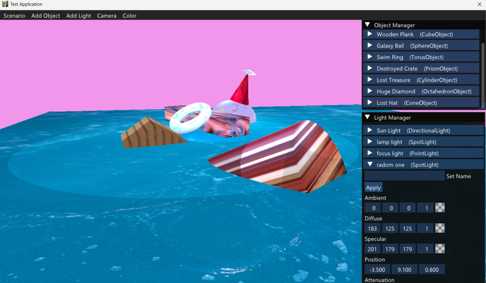

# Physics Simulation Project




This repository contains a physics simulation framework split into three main components:

1. **Google Testing Framework** - A unit testing framework to verify the correctness of the physics simulation.
2. **Simulation Sandbox** - A real-time simulation environment for visualizing and testing physics interactions.
3. **Physics Static Library** *(Ongoing Development)* - A reusable physics engine library providing core physics computations and utilities.

---

## Project Structure

### 1. Google Testing Framework
- Implements unit tests for validating core physics functionalities.
- Ensures correctness and stability of physics computations.
- Uses Google Test for automated testing.

### 2. Simulation Sandbox
- A real-time physics simulation environment.
- Implements various physics interactions such as object motion, collisions, and forces.
- Provides UI tools via ImGUI for debugging and visualization.
- Supports:
  - Rendering of basic primitives (cubes, spheres, etc.)
  - Texture mapping and lighting system
  - Dynamic object creation
  - Scenario-based simulations
  - JSON-based scenario loading and state management
  
### 3. Physics Static Library *(Ongoing Development)*
- Will provide core physics calculations and utilities.
- Designed for reusability across different projects.
- Planned features:
  - Collision detection algorithms
  - Rigid body dynamics
  - Mathematical utilities for physics calculations
  
---

## Features

### ✅ Completed Tasks
- **Timer System** - Tracks elapsed time for consistent physics updates.
- **Rendering System** - Handles basic shapes, lighting, and textures.
- **Physics Core** - Implements dynamic object simulation.
- **Scenario System** - Loads and manages different simulation scenarios.
- **ImGUI Debugging Tools** - Provides UI controls for modifying objects in real time.
- **Unit Testing** - Uses Google Test to ensure stability and correctness.

### 🔧 Planned Enhancements
- **Optimize Physics Engine** - Improve efficiency of physics calculations.
- **Advanced Collision Handling** - Enhance accuracy of object interactions.
- **More Scenarios** - Add additional test cases for physics behaviors.
- **Refined Lighting System** - Improve shadows and dynamic light sources.
- **Develop Physics Static Library** - Implement core physics features step by step.

---

## Installation & Usage

### Prerequisites
- Visual Studio Community 2022
- Google Test (for testing framework)
- ImGUI (for UI rendering in Sandbox)

### Build Instructions
1. Open **Visual Studio Community 2022**.
2. Clone the repository:
   ```sh
   git clone <repository-url>
   ```
3. Open the solution file (`.sln`) for each component:
   - `simulation-sandbox.sln`
   - `google-testing.sln`
   - `physics-static-lib.sln` *(once implemented)*
4. Build the projects in **Release** or **Debug** mode.
5. Run the **Simulation Sandbox** executable to visualize simulations.
6. Run **Google Testing** to verify physics calculations.

---

## Contribution
Feel free to contribute by submitting pull requests, reporting issues, or suggesting improvements. 

---

## License
This project is licensed under the MIT License.

